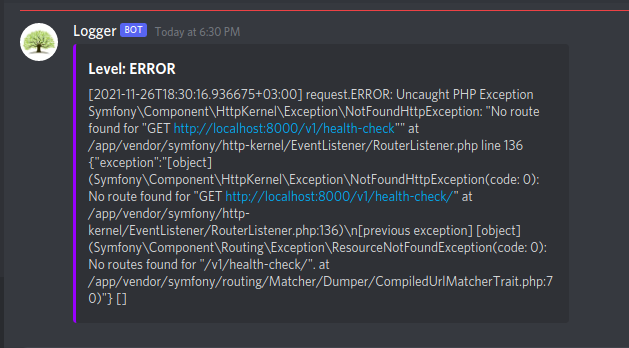

# Nullabler/monolog-discord
[](https://packagist.org/packages/unixoff/monolog-discord) 
[](https://packagist.org/packages/unixoff/monolog-discord) 
[](https://packagist.org/packages/unixoff/monolog-discord) 
[](https://packagist.org/packages/unixoff/monolog-discord)

This package for sending logs of discord to a webhook channel

-------------------------------------------------
## Installation
`composer require Nullabler/monolog-discord`

## Usage
```php
<?php

require 'vendor/autoload.php';

use Nullabler\MonologDiscord\DiscordWebhookHandler;

$webhook = 'Your Webhook URL';

$log = new Monolog\Logger('discord');
$log->pushHandler(new DiscordWebhookHandler($webhook));

$log->info('hello world!');
```



## Symfony setting
```yaml
monolog:
    handlers:
        main:
            ...
        discord_webhook_handler:
            type: service
            id: discord_webhook_handler

services:
    discord_webhook_handler:
        class: MonologDiscord\DiscordWebhookHandler
        arguments:
            $webhookUrl: '%env(string:DISCORD_WEBHOOK)%'
```

# License
See the [LICENSE](LICENSE.md) file for license rights and limitations (MIT).
